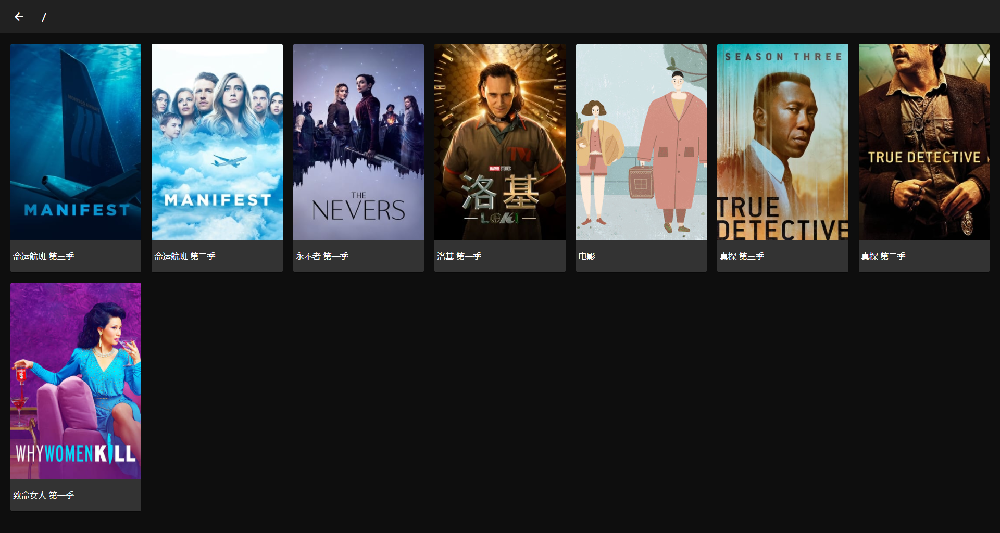
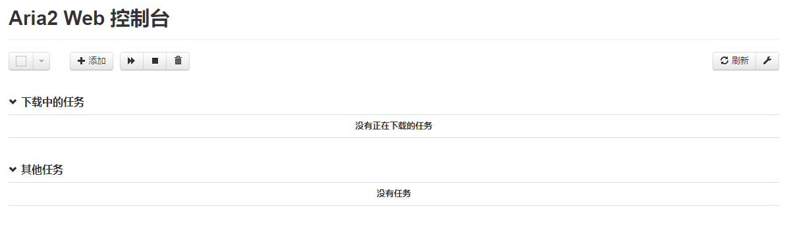

# MediaServer
> (树莓派)流媒体服务器

### 1. install media-server

```
git clone https://github.com/PPeanutButter/MediaServer.git
```



### 2.Configuration

###### 2.1 edit user.json to add a user with password

```json
{"name": "password", "ip": []}
```

###### 2.2 mark a dir as a media dir

```shell
# Add a cover image (a .cover file) to a TV series folder
# S01|E01.mkv
#    |E02.mkv
#    |.cover (jpg, png, webp. whatever)
```

###### 2.3 start server with specific dir such

```shell
# assume your hard driver is mounted to /media/pi/NAS500
# to support run on start, add to screen script.
sudo python3 app.py /media/pi/NAS500
# open http://localhost/
```

###### 2.4 no media showed?

```shell
# The media dir structure should be something like below
# NAS500|
# 		xxS01|E01.mkv
# 		     |E02.mkv
# 		     |.cover (jpg, png, webp. whatever)
# 		xxS02|E01.mkv
# 		     |E02.mkv
# 		     |.cover (jpg, png, webp. whatever)
#		xxxS01|E01.mkv
# 		      |E02.mkv
# 		      |.cover (jpg, png, webp. whatever)
```

### 3. remote download support (Optional)



````shell
# you can remote download a file to your raspberry.
sudo apt-get install aria2
````

###### 2.1 edit aria2.conf

```shell
# set download dir
dir=/media/pi/NAS500/Download
# where to save and load aria2 session
# session file must be created (by
# touch /home/pi/Program/MediaServer/aria2.session)
input-file=/home/pi/Program/MediaServer/aria2.session
save-session=/home/pi/Program/MediaServer/aria2.session
# important
rpc-secret=<your secret key>
```

###### 2.3 start aria2 server

```shell
# to support run on start, add to screen script.
aria2c --conf-path=path.to.your.aria2.conf
# open http://localhost/download or from http://localhost/ click download button
```

###### 2.3 aria2 service connect error?

```shell
# open setting, the JSON-RPC Path should be
# ws://token:<your secret key>@<your server ip>:6800/jsonrpc
```


